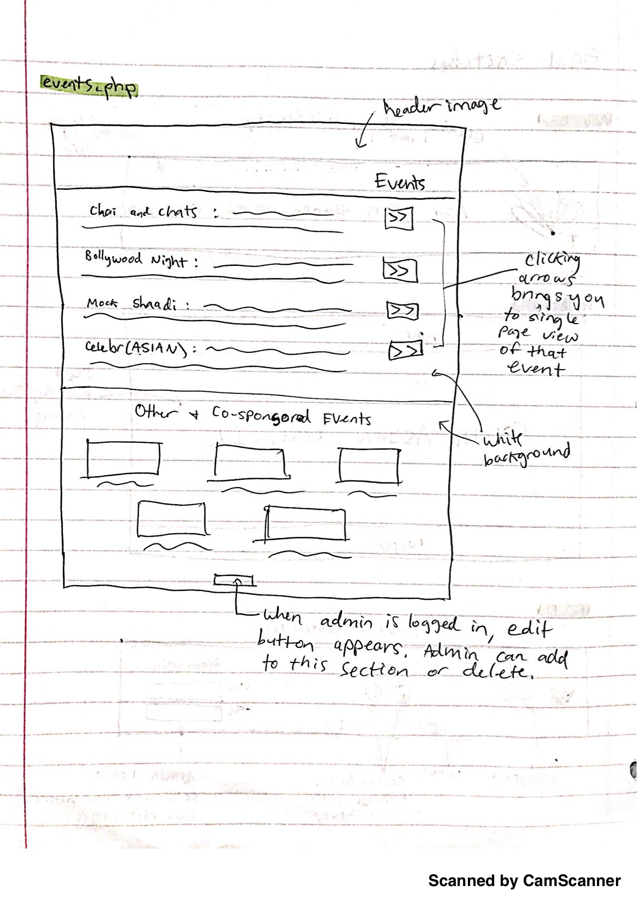

# Project 4: Design Journey

Your Team Name: Silver-Deer

**All images must be visible in Markdown Preview. No credit will be provided for images in your repository that are not properly linked in Markdown. Assume all file paths are case sensitive!**


## Client Description

* Our client is the South Asian Council. They are an umbrella organizaion for all
organizations associated with South Asia. Their three missions are: raising awareness
& advocacy, support the South Asian community, collaberate and cooperate.

* They want a new website to showcase events they are hosting to keep the members up to date as well as for interested people looking to join to know more about what they do and what they are about.

* key goals:
  * events
  * members page
  * mission/about
  * academic resources
  * ability to update information

[Tell us about your client. Who is your client? What kind of website do they want? What are their key goals?]

[NOTE: If you are redesigning an existing website, give us the current URL and some screenshots of the current site. Tell us how you plan to update the site in a significant way that meets the final project requirements.]


## Meeting Notes

[By this point, you have met once with your client to discuss all their requirements. Include your notes from the meeting, an email they sent you, or whatever you used to keep track of what was discussed at the meeting. Include these artifacts here.]


## Purpose & Content

Spread awareness about their organization and have a place for all their content
beside their facebook page.

[Tell us the purpose of the website and what it is all about.]


## Target Audience(s)
* Current members: they would be able to see what events are coming up and also update the page to inform others about future events
* Prospective members: those potentially interested in events and about the organization can learn about things happening in the near future as well as what the organization is aiming to do

[Tell us about the potential audience for this website. How, when, and where would they interact with the website? Get as much detail as possible from the client to help you find representative users.]


## Client Requirements & Target Audiences' Needs

**Client Requirement 1:**
- Powerpoints for Chai & Chats
**Design Ideas and Choices**
- All events featured on Events page and clicking on specific event leads to single page view
**Rationale**
- Having a single page view will allow users to access all powerpoints for that event and for other events have access to specific information regarding those. This makes the event page less cluttered and organizes information for easier access.

**Client Requirement 2:**
- Updating page on client end
**Design Ideas and Choices**
- Require admin login and show edit page button if logged in user is admin
**Rationale**
- Only the exec board members with admin access should be able to edit website content. Pages that can be edited include members, events, and home page.

**Audience Need 1:**
- Email list form + Contact Us page
**Design Ideas and Choices**
- Group together email list form with contact us page so that target audience has a page for resources in order to contact exec board if needed, including getting information by adding self to email list
**Rationale**
- Users who want to be added to an email list will likely go to the Contact page to reach out and try and get added. This simplifies things on the client end by reducing those emails and having a form which provides email data.


[Collect your client's needs and wants for the website. Come up with several appropriate design ideas on how those needs may be met. In the **Rationale** field, justify your ideas and add any additional comments you have. There is no specific number of needs required for this, but you need enough to do the job.]

Example:
- (_pick one:_) Client Requirement/Target Audience Need
  - **Requirement or Need** [What does your client and audience need or want?]
    - Client wants to cater to people who speak different languages.
  - **Design Ideas and Choices** [How will you meet those needs or wants?]
    - Create web-pages manually in multiple languages.
  - **Rationale** [Justify your decisions; additional notes.]
    - Create multiple pages in multiple languages manually.


## Initial Design

[Include exploratory idea sketches of your website.]


## Information Architecture, Content, and Navigation

**Navigation**
- Home Page
- About us
  - Mission statement + values
  - How they were founded
- Events (Williard Straight Room 411)
(go to facebook page for even descriptions, photos on instagram page, 4 events on the page at once)
(calendar for events on the bottom)
  - Chai & chats
  - Bollywood night
  - Mock shaadi
  - celebr(ASIAN) with CAPSU
- External resources/academics
  - Academic programs
    - AASP (asian american studies program)
    - SAP (south asia program)
  -Resources
  - A3C (asian american learning center)
  - ALANA: BSU, LAL, NAISAC, CAPSU
  -South Asian Non-Profits (will be sent)
- Members
- Contact
  - Contact Form
  - Social Media
  - Email
Seperate organizations page! - Member organizations

**Content**
- *Home*: first will show background image with organization title, underneath include upcoming events and announcements
- *About*: have their mission statement and values, will include section with member organizations represented with logos which are links to their websites
- *Events*: list of all events with short descriptions and clicking on specific event leads to single page view with more info.
- *Resources*: include short descriptions of all the related academic programs and organizations and link to their desginated websites
- *Members*: will show image and name of each exec board member + position and clicking on photo and will show modal box with biography
- *Contact*: link to social media websites and email, include email listserv form, contact form to email message

**Process**

[Lay out the plan for how you'll organize the site and which content will go where. Note any content (e.g., text, image) that you need to make/get from the client.]

[Document your process, we want to see how you came up with your content organization and website navigation.]

[Note: There is no specific amount to write here. You simply need enough content to do the job.]

  - 
  - We decided to plan out our organization based on a card sort. After doing so, we were able to group related material and designate it to a specific pages.


## Interactivity

[What interactive features will your site have? What PHP elements will you include?]

[Also, describe how the interactivity connects with the needs of the clients/target audience.]

- Member Modal Box
 - *Description*: when clicking on member's photo, a modal box will pop up with a more in depth description
 - *Reasoning*: this gives users easy access to more information about specific board member without having to open a separate page
 - Interactive Photo Gallery for Events
  - *Description*: on the single view event page, will include interactive gallery with photos from event if applicable
  - *Reasoning*: allows users to get visual representation of event so that they can better see if this is something they would be interested in attending
- Single View Page for Events
  - *Description*: when clicking a specific event on events page, will lead to single view of that event with more information
  - *Reasoning*: will allow image galleries and powerpoints to go on separate pages to minimize content on events page so that it is easier on users to read about each specific event


## Work Distribution

[Describe how each of your responsibilities will be distributed among your group members.]

[Set internal deadlines. Determine your internal dependencies. Whose task needs to be completed first in order for another person's task to be relevant? Be specific in your task descriptions so that everyone knows what needs to be done and can track the progress effectively. Consider how much time will be needed to review and integrate each other's work. Most of all, make sure that tasks are balanced across the team.]

We will work together on Home page and Nav bar in person, then each member gets own designated page:
- *Member Organizations + Login Editing* - Thomas
  - login only for admin
  - login will be in nav bar
  - when logged in, can edit pages
- *Events* - Alisa
  - single view page per event
- *Members* - Sophia
  - modal box
- *Contact* - Lily
  - contact form
  - social media links
- *Academic Resources* - Annika
  - links to websites
  - descriptions

We will work with one another on creating databases and visual design.

## Additional Comments

[If you feel like you haven't fully explained your design choices, or if you want to explain some other functions in your site (such as special design decisions that might not meet the final project requirements), you can use this space to justify your design choices or ask other questions about the project and process.]


--- <!-- ^^^ Milestone 1; vvv Milestone 2 -->

## Client Feedback

[Share the feedback notes you received from your client about your initial design.]
- Have member orgs as separate page
  -Have descriptions (blurbs from orgsync) and logos
- Include co-sponsored events on events page
- No email list form, since they do not have a listserv
- Include South Asian Non-Profits on the resources page


## Iterated Design

[Improve your design based on the feedback you received from your client.]


[Second round of sketches]
Second round of sketches:


## Evaluate your Design

[Use the GenderMag method to evaluate your wireframes.]

[Pick a persona that you believe will help you address the gender bias within your design.]

I've selected **Abby** as my persona.

I've selected my persona because Abby is the most risk adverse to technology and is most dependent on strong user design in order to navigate and use the website. Since our target audience can entail anyone from a range of technological backgrounds, we want to accommodate to everyone's experience and needs.

### Tasks

[You will need to evaluate at least 2 tasks (known as scenarios in the GenderMag literature). List your tasks here. These tasks are the same as the task you learned in INFO/CS 1300.]

[For each task, list the ideal set of actions that you would like your users to take when working towards the task.]

Task 1: Find out when the next upcoming event is

  1. Action 1: Click the events tab
  2. Action 2: Look at the date of the next event

Task 2: Contact the coucil to see if any member positions are open

  1. Action 1: Click member tab
  2. Action 2: See who is graduating for open positions
  3. Action 3: Click contact tab
  4. Action 4: Fill out contact form


### Cognitive Walkthrough

[Perform a cognitive walkthrough using the GenderMag method for all of your Tasks. Use the GenderMag template in the <documents/gendermag-template.md> file.]

#### Task 1 - Cognitive Walkthrough

[copy the GenderMag template here and conduct a cognitive walkthrough to evaluate your design (wireframes).]

[You may need to add additional subgoals and/or actions for each task.]

# GenderMag Template

**Task name: Find out when the next upcoming event is**

[Add as many subgoals as you needs]
**Subgoal # 1 : Navigate to the events page**
  (e.g., "# 1 : Select the section of the document you want to print")

  - Will [persona name] have formed this sub-goal as a step to their overall goal?
    - Yes, maybe or no: Yes
    - Why? (Especially consider [persona name]'s Motivations/Strategies.)

        Going to the page that contains the information you want is common among all websites, so it should be a subgoal that Abby is familiar with.

[Add as many actions as you need...]
**Action # 1 : Click on the events link in the navbar**
  (e.g., "# 1 : Put the mouse at the beginning of the section you want to print")

  - Will [persona name] know what to do at this step?
    - Yes, maybe or no: Yes
    - Why? (Especially consider [persona name]'s Knowledge/Skills, Motivations/Strategies, Self-Efficacy and Tinkering.)

        As mentioned earlier, it's a common task, so Abby is familiar with it.

  - If [persona name] does the right thing, will she know that she did the right thing, and is making progress towards her goal?
    - Yes, maybe or no: Yes
    - Why? (Especially consider [persona name]'s Self-Efficacy and Attitude toward Risk.)

        She will see that she is on the events page.

**Subgoal # 2 : Find out the date of the next event**
  (e.g., "# 1 : Select the section of the document you want to print")

  - Will [persona name] have formed this sub-goal as a step to their overall goal?
    - Yes, maybe or no: Yes
    - Why? (Especially consider [persona name]'s Motivations/Strategies.)

        Well the task is to find the date of the next event so this is the logical step to take for anyone.

[Add as many actions as you need...]
**Action # 1 : Look at the date of the next upcoming event**
  (e.g., "# 1 : Put the mouse at the beginning of the section you want to print")

  - Will [persona name] know what to do at this step?
    - Yes, maybe or no: Yes
    - Why? (Especially consider [persona name]'s Knowledge/Skills, Motivations/Strategies, Self-Efficacy and Tinkering.)

        Yes, even if the layout of the website is unfamiliar, dates are used widely everywhere so it will be easy to recognize when a date is displayed, and once you see a date next to the event, it is reasonable to assume that that means the event is on that date.

  - If [persona name] does the right thing, will she know that she did the right thing, and is making progress towards her goal?
    - Yes, maybe or no: Yes
    - Why? (Especially consider [persona name]'s Self-Efficacy and Attitude toward Risk.)

        She will see the date next to the event.

*Source*: Margaret Burnett, Simone Stumpf, Laura Beckwith, and Anicia Peters, "The GenderMag Kit: How to Use the GenderMag Method to Find Inclusiveness Issues through a Gender Lens", http://gendermag.org, Feb. 1 2018 .

#### Task 2 - Cognitive Walkthrough

# GenderMag Template

**Task name: Contact the coucil to see if any member positions are open**

[Add as many subgoals as you needs]
**Subgoal # 1 : Find graduating members**
 - Will Abby have formed this sub-goal as a step to their overall goal?
    - Yes, maybe or no: [yes]
    - Why? (Especially consider Abby's Motivations/Strategies.)
      Because members is one of the more prominent parts of our project, Abby
      will see that she might want to look under the members tab if she wants
      a member position

[Add as many actions as you need...]
**Action # 1 : Click member tab**
  - Will Abby know what to do at this step?
    - Yes, maybe or no: [yes]
    - Why? (Especially consider Abby's Knowledge/Skills, Motivations/Strategies, Self-Efficacy and Tinkering.)
    Abby doesn't enjoy tinkering, but because its clear and the nav is on every
    site she shouldn't miss the member tab.

  - If Abby does the right thing, will she know that she did the right thing, and is making progress towards her goal?
    - Yes, maybe or no: [yes]
    - Why? (Especially consider Abby's Self-Efficacy and Attitude toward Risk.)
    Clicking the tab will show the member page where we have a huge label for
    "member" as a subtitle

**Action # 2 : See who is graduating for open positions**
  - Will Abby know what to do at this step?
    - Yes, maybe or no: [maybe]
    - Why? (Especially consider Abby's Knowledge/Skills, Motivations/Strategies, Self-Efficacy and Tinkering.)
    There is no search to see who is graduating, but she can read through every
    current members' profile to see when they are graduating which could mean
    a position will be opening up.

  - If Abby does the right thing, will she know that she did the right thing, and is making progress towards her goal?
    - Yes, maybe or no: [yes]
    - Why? (Especially consider Abby's Self-Efficacy and Attitude toward Risk.)
      Once she finds someone's graduation year, she can look at that same persons
      role and keep a note of their position as ones she would potentially apply
      for.

**Subgoal # 2 : Contact the SAC**

  - Will Abby have formed this sub-goal as a step to their overall goal?
    - Yes, maybe or no: [yes]
    - Why? (Especially consider Abby's Motivations/Strategies.)
    If she wants a position it is logical to contact the organization.

**Action # 3: Click contact tab**

  - Will Abby know what to do at this step?
    - Yes, maybe or no: [yes]
    - Why? (Especially consider Abby's Knowledge/Skills, Motivations/Strategies, Self-Efficacy and Tinkering.)
    Contact is one of the 5 tab options in the nav bar, should be easy to find

  - If Abby does the right thing, will she know that she did the right thing, and is making progress towards her goal?
    - Yes, maybe or no: [yes]
    - Why? (Especially consider Abby's Self-Efficacy and Attitude toward Risk.)
      The page will change to the contact page

**Action # 4: Fill out contact form**
	(e.g., "# 1 : Put the mouse at the beginning of the section you want to print")
  - Will Abby know what to do at this step?
    - Yes, maybe or no: [yes]
    - Why? (Especially consider Abby's Knowledge/Skills, Motivations/Strategies, Self-Efficacy and Tinkering.)
    Every part of the form is labeled and easy to follow including entering her
    name, email, and comments

  - If Abby does the right thing, will she know that she did the right thing, and is making progress towards her goal?
    - Yes, maybe or no: [yes]
    - Why? (Especially consider Abby's Self-Efficacy and Attitude toward Risk.)
    We will thank her after she submits the form to know that the form was
    filled out correctly

*Source*: Margaret Burnett, Simone Stumpf, Laura Beckwith, and Anicia Peters, "The GenderMag Kit: How to Use the GenderMag Method to Find Inclusiveness Issues through a Gender Lens", http://gendermag.org, Feb. 1 2018 .

### Cognitive Walk-though Results

[Did you discover any issues with your design? What were they? How will you change your design to address the gender-inclusiveness bugs you discovered?]

* we still need to implement confirmation after they submit the contact form; confirmation must show message, email sent from, name, and message so Abby knows exactly what she sent.
* One problem we had with the members page was that when the member images were hovered over, there was nothing that signified that they could be clicked on. This is a design flaw, since each member image pops open to a modal box with more information, such as graduation year, which Abby would need to know if she wanted to find out who was graduating. In order to change this, we made the images change opacity on hover as a signal that they could be clicked on.
* We need to make sure to update events (or leave this to our client) so the users don't get confused if they are looking at a date that has already passed— we achieved this by adding an editing feature for admins who log in, so events can be deleted and added. This keeps users like Abby informed and up to date on the club's activities.
* For finding upcoming events, Abby can find all the information she needs about each event on their single-view pages. This page will have posters and powerpoints from each event so she can find what she needs.


[Your responses here should be **very** thorough and thoughtful.]


## Final Design

[Include sketches of your finalized design.]





[What changes did you make to your final design based on the results on your cognitive walkthrough?]
* more interactivity, such as searching through tags, editing pages so the admins could add/delete events and resources, better feedback for users (such as hovering over member images to signify links can be clicked on)

## Database Schema

[Describe the structure of your database. You may use words or a picture. A bulleted list is probably the simplest way to do this.]
--Store admin data
CREATE TABLE `admin` (
  id INTEGER NOT NULL PRIMARY KEY AUTOINCREMENT UNIQUE,
  username TEXT NOT NULL UNIQUE,
  password TEXT NOT NULL
);

// Make tables so that the client can edit their pages //

--Resources table
CREATE TABLE `resources` (
  id INTEGER NOT NULL PRIMARY KEY AUTOINCREMENT UNIQUE,
  title TEXT NOT NULL UNIQUE, (name of the resource)
  description TEXT NOT NULL, (description of the resources)
  icon TEXT NOT NULL, (path to the image of the resource logo)
  link TEXT NOT NULL, (link to resource website)
  type TEXT NOT NULL ('academic' or 'non-profit' resource)
);

--Member Organizations table
CREATE TABLE `orgs` (
  id INTEGER NOT NULL PRIMARY KEY AUTOINCREMENT UNIQUE,
  title TEXT NOT NULL UNIQUE, (name of the organization)
  description TEXT NOT NULL, (description of the organization, taken from OrgSync)
  icon TEXT NOT NULL, (path to the image of the resource logo)
  link TEXT NOT NULL, (link to org website)
);

--Members table
CREATE TABLE `members` (
  id INTEGER NOT NULL PRIMARY KEY AUTOINCREMENT UNIQUE,
  image TEXT NOT NULL, (path to member images),
  name TEXT NOT NULL, (member name),
  position TEXT NOT NULL, (exec board position of member)
  year INT NOT NULL, (graduation year)
  description TEXT NOT NULL
);

--Events table
CREATE TABLE `events` (
  id INTEGER NOT NULL PRIMARY KEY AUTOINCREMENT UNIQUE,
  type TEXT NOT NULL, (one of 4: 'Chai & Chat', 'Bollywood Night', 'Mock Shaadi', or 'celebr(ASIAN) with CAPSU')
  title TEXT NOT NULL, (event title)
  date TEXT NOT NULL, (date of the event, TBD if not known)
  description TEXT NOT NULL, (description of the event)
  location TEXT NOT NULL,
  file TEXT (can be null, if the event has a powerpoint or image to go with it, like Chai & Chats)
);


## Database Queries

[Plan your database queries. You may use natural language, pseudocode, or SQL.]
`admin`:
- only allow login if the admin username and password matches

`resources`
- based on their type, put database items in different divs
- display icon (with link attached to it), title, and description

`orgs`
- display icon (with link attached to it), title, and description

`members`
- display all member images, names, and positions on the page
- only when images are clicked on and the modal box appears can users see year and description

`events`
- if event date is in the coming week, display in upcoming events slideshow on home page
- if event date has passed, put into "past events" section of events page
- when users click one of the four types of events, display all of the events with that type only
- show title, date, description, and location one event type is selected


## PHP File Structure

[List the PHP files you will have. You will probably want to do this with a bulleted list.]

* index.php - main page.
* includes/init.php - stuff that useful for every web page.
* includes/header.php - contains head and title
* includes/nav.php - navigation to go to different sites
* includes/footer.php - social media
* about.php - general info
* events.php - club events
* organizations.php - organizations under SAC
* members.php - member headshots
* resources.php - linkes to eternal resources
* contact.php - form to contact SAC


## Pseudocode

[For each PHP file, plan out your pseudocode. You probably want a subheading for each file.]

### index.php

```
Pseudocode for index.php...

include init.php

if (user_is_logged_in) {
  display an edit button that allows you to edit the page
}

```
### includes/footer.php

```
Admin login will be here
if user_is_logged_in()
      display logout button
    else
      just show login form
```

### about.php
```
Pseudocode for index.php...

include init.php

if (user_is_logged_in) {
  display an edit button that allows you to edit the page
}

```
###events.php
```
Pseudocode for events.php...

include init.php

foreach $event in $events {
  echo the event's information like title, date, description, etc.
}

if (user_is_logged_in) {
  display an edit button that allows you to edit the page
}
when click on event section on event page
  opens new page with more information on event

when click on back button on single event page
  opens event page

```
###organizations.php
```
Pseudocode for index.php...

include init.php

foreach $event in $events {
  echo the member organization's information
}

if (user_is_logged_in) {
  display an edit button that allows you to edit the page
}

```

###members.php
```
Pseudocode for index.php...

include init.php

foreach member in members {
  display_function ( member )
}

function display_function($member) {
  echo '';
}

```

###resources.php
```
Pseudocode for resources.php...

include init.php
include header.php
function create_resource_box($link, $icon, $title, $description)
 - function to create a box given our resources
get sql query for resources and info about them
- to retrive: link, icon, title, description
loop through all resources and create box
if admin is logged in make all resources editable
  - update query
  - remove query
  - maybe a form for the client to edit?
include footer.php

```

###contact.php
```
Pseudocode for contact.php...
include init.php
include header.php
create a functional email form using php
- to send the email: $to (exec board member email), $subject, mail($to, $subject) function;
- $email_from, $email_subject, $email_body
```


## Additional Comments

[Add any additional comments you have here.]


--- <!-- ^^^ Milestone 2; vvv Milestone 3 -->

## Issues & Challenges

[Tell us about any issues or challenges you faced while trying to complete milestone 3. Bullet points preferred.]
* Implementing an email form— can only check if it works by connecting the website to a server with Heroku


--- <!-- ^^^ Milestone 3; vvv FINAL SUBMISSION-->

## Final Notes to the Clients

[Include any other information that your client needs to know about your final website design. For example, what client wants or needs were unable to be realized in your final product? Why were you unable to meet those wants/needs?]
On our site, we were not able to implement a feature that shows the next upcoming event, since many of their dates are TBD. Instead, we gave our client an option to edit events and add things on their own for their own flexibility.

## Final Notes to the Graders

[1. Give us three specific strengths of your site that sets it apart from the previous website of the client (if applicable) and/or from other websites. Think of this as your chance to argue for the things you did really well.]
Our client did not have a website previously, so we were able to start from scratch. Some strengths of our site include
1) Admin login for editing, so they can add resources and events to update club members
2)an email form so prospective members can contact board members
3)a members page that shows board members and gives information about them, with nice descriptions

[2. Tell us about things that don't work, what you wanted to implement, or what you would do if you keep working with the client in the future. Give justifications.]
One thing that would be cool to implement in the future is a "upcoming events" section on the home page, where it would change depending on whether the event has passed or not. THis would be usedful for club members, but unfortunately we didn't have the means to implement it for this project.

[3. Tell us anything else you need us to know for when we're looking at the project.]
*Email form only works when conncted to the server
*On events page Chai and Chats, our client wanted the actual powerpoints embedded, but since this was against the rules for this project we just put screenshots.
